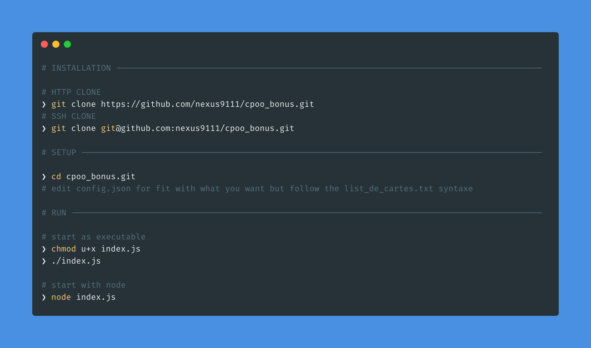
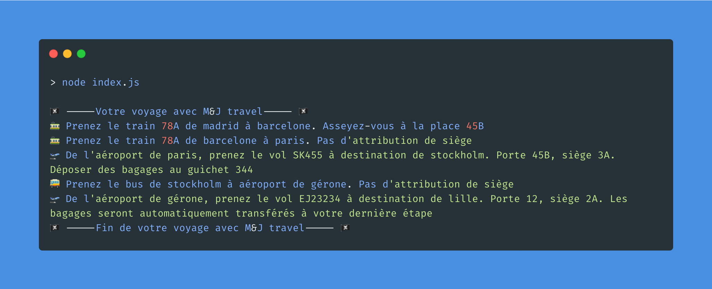
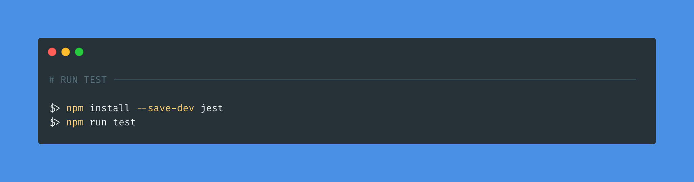

## Exercice bonus CPOO

### 🔍 Enoncé

Exercice bonus (niveau ✈️)

On vous remet une pile de cartes d'embarquement pour différents transports qui vous mèneront d'un point A à un point B en passant par plusieurs arrêts en cours de route. Toutes les cartes d'embarquement sont en désordre et vous ne savez pas où commence et où finit votre voyage. Chaque carte d'embarquement contient des informations sur l'affectation des sièges et le moyen de transport (numéro de vol, numéro de bus, etc.).

Écrivez une API qui vous permette de trier ce type de liste et de renvoyer une description de la manière de terminer votre voyage.

Par exemple, l'API devrait être capable de prendre un ensemble non ordonné de cartes d'embarquement, fournies dans un format défini par vous, et de produire cette liste :

"	Prenez le train 78A de Madrid à Barcelone. Asseyez-vous à la place 45B.
"	Prenez le bus de l'aéroport de Barcelone à l'aéroport de Gérone. Pas d'attribution de siège.
"	De l'aéroport de Gérone, prenez le vol SK455 à destination de Stockholm. Porte 45B, siège 3A. Dépose des bagages au guichet 344.
"	De Stockholm, prenez le vol SK22 à destination de New York JFK. Porte 22, siège 7B. Les bagages seront automatiquement transférés de votre dernière étape.
"	Vous êtes arrivé à votre destination finale.

La liste doit être définie dans un format compatible avec le format d'entrée. 

### 📕 Proposition de solution

#### Langage utilisé: JavaScript/Node

### ⚙️ Requirements:

<a href="https://nodejs.org/en/download/">💾 Installer Node</a>

### ✨ Setup:

### 📍 Example of use with given example

### 📐 Unite test

### License

Date: 09/11/2021  
Author: Joss C, Marie-Eden M

